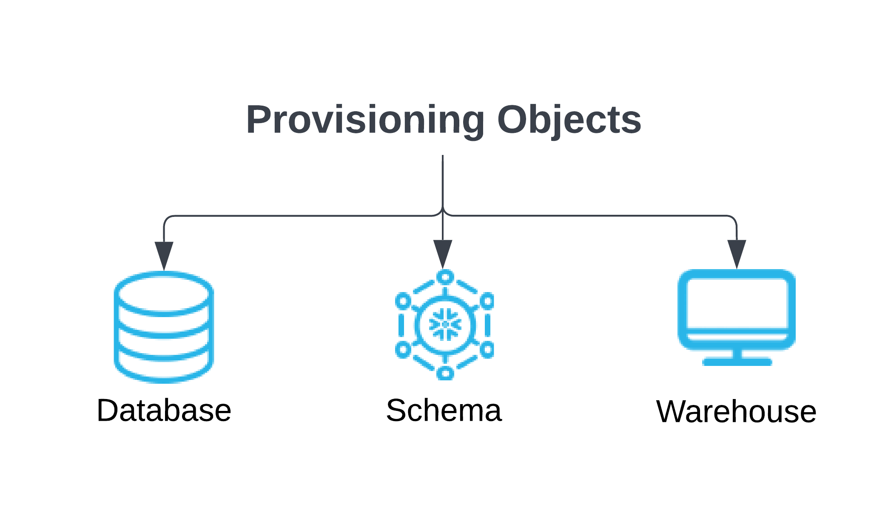
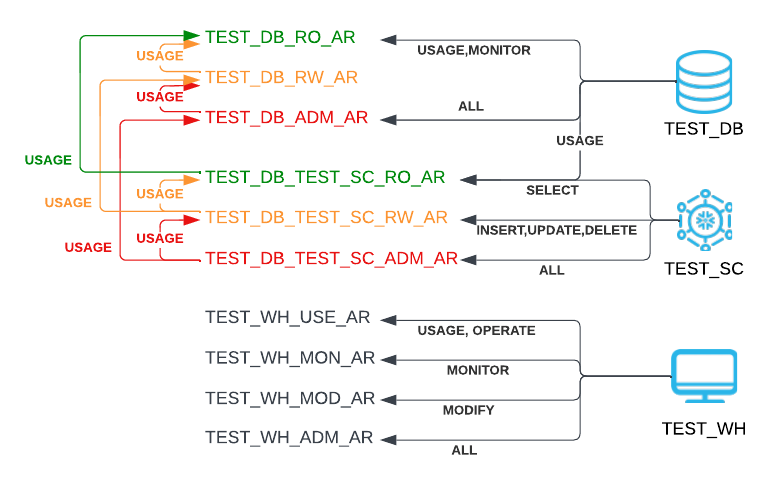
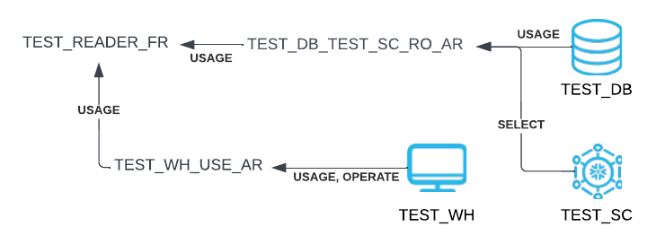

# snowflake-provisioning

Provisioning of Snowflake Database, Schema, and Warehouse objects with Access Roles & Generating and Provisioning of
Functional Roles. 

## Table of Contents

The documentation has been split out into two separate sections - the first section is for provisioning Databases, Schemas,
and Warehouses. The second section covers scripted provisioning of functional roles and how to generate the configuration. 

1. [Overview of Provisioning Database, Schema, and Warehouse objects](#overview-of-provisioning-database,-schema,-and-warehouse-objects)
   1. [Functional and Access roles](#functional-and-access-roles)
   1. [Creating a Functional role](#creating-a-functional-role)
   1. [Configuration](#configuration)
   1. [Executing](#executing)
   1. [Creating and Dropping Warehouses](#creating-and-dropping-warehouses)
1. [Automating Functional Roles](#automating-functional-roles)
   1. [Stored Procedures to make future grants queryable](#stored-procedures-to-make-future-grants-queryable)
   1. [Generating Configuration](#generating-configuration)
   1. [Provisioning Functional Role](#provisioning-functional-role)
1. [Exporting Snowflake Source](#exporting-snowflake-source)
1. [Cloning tables between schemas](#cloning-tables-between-schemas)
1. [Tieout comparing data](#tieout-comparing-data)
1. [TODO](#todo)
1. [Author](#author)
1. [Credits](#credits)
1. [License](#license)

## Overview of Provisioning Database, Schema, and Warehouse objects

This repository contains a Python-based Snowflake Database/Schema/Warehouse Provisioning script, that provides a
framework for deploying objects with configurable and customizable access roles.

Snowflake supports a highly granular and configurable RBAC[^1] (Role-Based Access Control) scheme.
The possibilities of configuration are endless and it is almost too complex to understand when you are new to Snowflake.
`sf_create_obj` aims to provide an example of an implementation that can be easily extended while showing all sql
commands used to build out the framework with. This also allows for easy integration with
[schemachange](https://github.com/Snowflake-Labs/schemachange)/
[Snowchange](https://jeremiahhansen.medium.com/snowchange-a-database-change-management-tool-b9f0b786a7da) as both deploy
and rollback output is provided.

### Functional and Access roles

Best practice as recommended by Snowflake is to separate functional access from the underlying object access, i.e.,
database, schema, individual tables, etc.

Functional access can be defined as a role that a script or user needs to perform and operation across many schemas or
databases. In the examples provided all functional roles have a postfix of \_FR in the role name. 

Access roles govern access to one or more privileges on an object. An example is an access role that provides write
access to all tables in a schema. Access roles often are nested and a role at a database level can provide access to
all underlying schemas. That means rather than explicitly granting a privilege it can be inherited from another role.
A common convention that is followed here is to use a postfix of \_AR to signify an access role. 

Using \_AR and \_FR to provide clear separation between roles makes it easier to quickly see the difference when looking
at the roles in Snowflake. Taking this one step further to simplify how your roles are shown in both Snowflake's
Classic UI as well as Snowsight this framework allows you to prefix access roles with a custom name which includes an
underscore (\_). This puts the access roles at the end of the role list and helps avoid users using access roles
directly. Having a customizable prefix also allows us to think ahead to the automation of functional roles. In the
sample configuration database access roles are prefixed by \_DB\_, schema access roles with \_SC\_, and warehouses
with \_WH\_ respectively. 

Inheritance between database and schema access roles is setup based on configurable parameters and is managed
automatically between database and schemas as a simplified illustration below shows:



While the illustration might look complex at first it accomplishes quite a few things. For the database 3 different
roles are created and a hierarchy is formed from the lowest access role to the highest access role. In the example
the read-only (RO) role can only use and monitor the database TEST_DB; the read-write (RW) role doesn't have any
explicit privileges; and the admin (ADM) role is granted all privileges on the database. The role hierarchy is
created so that the RW role doesn't have to be granted explicit permission to use and monitor, but it inherits this
from the RO role.

Where that becomes more powerful is with the privileges granted at the schema level - the RO role at the schema level
is granted select on all (and future) tables in the schema. This privilege is in turn granted to the RO role at the
database level through role inheritance. The RW role is granted insert, update, and delete on all (and future) tables
in the schema and with the role inheritance the RW role at the database now has more functionality. This is why both
database and schema role hierarchy for this tool need to be in sync. 

The warehouse object is completely independent from databases and schemas so the naming convention and role hierarchy
can be different there as well. In the example here we have chosen to use 4 different types of access roles that each
represent privileges you may want to separate out. 

### Creating a Functional role

Putting these individual access roles together to form a simple functional role shows how powerful the role hierarchy
in Snowflake is: 
```SQL
CREATE ROLE IF NOT EXISTS TEST_READER_FR;
GRANT ROLE _SC_TEST_DB_TEST_SC_RO_AR TO ROLE TEST_READER_FR;
GRANT ROLE _WH_TEST_WH_USE_AR        TO ROLE TEST_READER_FR;
```
Leading to the following role hierarchy:

The TEST\_READER\_FR functional role is granted two explicit roles that give it access to use and operate the
warehouse TEST\_WH, use the database TEST\_DB, use the schema TEST\_SC, as well as select from all tables in the
TEST\_SC schema. 

With this flexibility it is possible to manage just a few functional roles that provides the exact access you want
across hundreds of databases and schemas through simple automation. 

This documentation doesn't aim to spell out a specific architectural strategy on how to separate environments in a
single Snowflake account, but gives you the flexibility to solve that yourself through your own naming convention.
An example is embedding PROD/TEST/DEV in your database name either as a prefix or embedded in the name. 

### Configuration

Each of the 3 types of objects that can be provisioned with this script need their own json-formatted configuration
file ([db-config.json](db-config.json), [sc-config.json](sc-config.json), [wh-config.json](wh-config.json)). 

The default [configuration](wh-config.json) for a warehouse is provided below:

```JSON
{
	"TYPE"              : "WAREHOUSE",
	"ROLE_OWNER"        : "SYSADMIN",
	"ROLE_HIERARCHY"    : [ "ADM", "MOD", "MON", "USE" ],
        "ROLE_PERMISSIONS"  : {
	                        "ADM" : { "ALL"            : [ "WAREHOUSE" ] },
	                        "MOD" : { "MODIFY"         : [ "WAREHOUSE" ] },
    	                        "MON" : { "MONITOR"        : [ "WAREHOUSE" ] },
	                        "USE" : { "USAGE, OPERATE" : [ "WAREHOUSE" ] }
   	},
        "DEFAULT_WH_PARAMS" : {
            "MAX_CLUSTER_COUNT"                   : 1,
            "MIN_CLUSTER_COUNT"                   : 1,
            "AUTO_SUSPEND"                        : 60,
            "AUTO_RESUME"                         : "True",
            "INITIALLY_SUSPENDED"                 : "True",
            "SCALING_POLICY"                      : "STANDARD",
            "COMMENT"                             : "sf_create_obj created warehouse",
            "STATEMENT_QUEUED_TIMEOUT_IN_SECONDS" : 1800,
            "STATEMENT_TIMEOUT_IN_SECONDS"        : 3600
	},
        "AR_PREFIX"         : "_WH_"
}
```
As described earlier the configuration of the provisioning tool allows you to create multiple different types of access roles. If you want to customize a special role that allows it to execute stored procedures and tasks, but not directly write to tables that is possible as long as you can specify it in Snowflake grant terms. 

### Executing

Embedded help is provided with the script:

```
$ ./sf_create_obj --help
usage: sf_create_obj [-h] {database,schema,warehouse} ...

Snowflake database, schema, and warehouse provisioning

positional arguments:
  {database,schema,warehouse}
                        sub-command help
    database            Provision database in Snowflake
    schema              Provision schema in Snowflake
    warehouse           Provision warehouse in Snowflake

optional arguments:
  -h, --help            show this help message and exit
```

Each object has its own options reflecting all the parameters for the given snowflake object. An example is the embedded help for creating a database:

```
$ ./sf_create_obj database --help
usage: sf_create_obj database [-h] [--data_retention_time_in_days DATA_RETENTION_TIME_IN_DAYS] [--max_data_extension_time_in_days MAX_DATA_EXTENSION_TIME_IN_DAYS] [--transient]
                              [--default_ddl_collation DEFAULT_DDL_COLLATION] [--comment COMMENT] [--tag TAG]
                              name

positional arguments:
  name                  Name of Snowflake object to provision

optional arguments:
  -h, --help            show this help message and exit
  --data_retention_time_in_days DATA_RETENTION_TIME_IN_DAYS
                        Time Travel in days 1 for standard edition 1-90 for higher editions
  --max_data_extension_time_in_days MAX_DATA_EXTENSION_TIME_IN_DAYS
                        Maximum number of days Snowflake can extend data retention period 1-90
  --transient           Applies to database and schema, creates transient object
  --default_ddl_collation DEFAULT_DDL_COLLATION
                        Default DDL Collation
  --comment COMMENT     Comment to add to object
  --tag TAG             Add a single tag_name=value to object
```

By default the script prints the DDL to STDOUT. This is to allow for pushing the create/drop (rollback) output
into a snowchange/schemachange pipeline for execution. 

### Creating and Dropping Warehouses

The simplest way to show how a warehouse could be provisioned is to run the script with the
[default configuration](wh-config.json) providing a warehouse name. The name of the object is validated against
allowed object names as part of the validation the script performs on each parameter.
```
$ ./sf_create_obj warehouse TEST_WH
CREATE WAREHOUSE IF NOT EXISTS TEST_WH
  AUTO_RESUME                         = TRUE
  AUTO_SUSPEND                        = 60
  COMMENT                             = 'sf_create_obj created warehouse'
  INITIALLY_SUSPENDED                 = TRUE
  MAX_CLUSTER_COUNT                   = 1
  MIN_CLUSTER_COUNT                   = 1
  SCALING_POLICY                      = STANDARD
  STATEMENT_QUEUED_TIMEOUT_IN_SECONDS = 1800
  STATEMENT_TIMEOUT_IN_SECONDS        = 3600
;
CREATE ROLE IF NOT EXISTS TEST_WH_USE_AR;
CREATE ROLE IF NOT EXISTS TEST_WH_MON_AR;
CREATE ROLE IF NOT EXISTS TEST_WH_MOD_AR;
CREATE ROLE IF NOT EXISTS TEST_WH_ADM_AR;

GRANT OWNERSHIP ON WAREHOUSE TEST_WH TO ROLE SYSADMIN REVOKE CURRENT GRANTS;
GRANT ALL PRIVILEGES ON WAREHOUSE TEST_WH TO ROLE SYSADMIN;
GRANT OWNERSHIP ON ROLE TEST_WH_USE_AR TO ROLE SYSADMIN REVOKE CURRENT GRANTS;
GRANT OWNERSHIP ON ROLE TEST_WH_MON_AR TO ROLE SYSADMIN REVOKE CURRENT GRANTS;
GRANT OWNERSHIP ON ROLE TEST_WH_MOD_AR TO ROLE SYSADMIN REVOKE CURRENT GRANTS;
GRANT OWNERSHIP ON ROLE TEST_WH_ADM_AR TO ROLE SYSADMIN REVOKE CURRENT GRANTS;

GRANT ROLE TEST_WH_USE_AR TO ROLE TEST_WH_MON_AR;
GRANT ROLE TEST_WH_MON_AR TO ROLE TEST_WH_MOD_AR;
GRANT ROLE TEST_WH_MOD_AR TO ROLE TEST_WH_ADM_AR;
GRANT ROLE TEST_WH_ADM_AR TO ROLE SYSADMIN;

GRANT USAGE, OPERATE ON WAREHOUSE TEST_WH TO ROLE TEST_WH_USE_AR;
GRANT MONITOR ON WAREHOUSE TEST_WH TO ROLE TEST_WH_MON_AR;
GRANT MODIFY ON WAREHOUSE TEST_WH TO ROLE TEST_WH_MOD_AR;
GRANT ALL ON WAREHOUSE TEST_WH TO ROLE TEST_WH_ADM_AR;
```
With an easy way to drop the warehouse, roles, and associated grants:
```
$ ./sf_drop_obj warehouse TEST_WH
REVOKE ALL ON WAREHOUSE TEST_WH FROM ROLE TEST_WH_ADM_AR;
REVOKE MODIFY ON WAREHOUSE TEST_WH FROM ROLE TEST_WH_MOD_AR;
REVOKE MONITOR ON WAREHOUSE TEST_WH FROM ROLE TEST_WH_MON_AR;
REVOKE USAGE, OPERATE ON WAREHOUSE TEST_WH FROM ROLE TEST_WH_USE_AR;

REVOKE ROLE TEST_WH_ADM_AR FROM ROLE SYSADMIN;
REVOKE ROLE TEST_WH_MOD_AR FROM ROLE TEST_WH_ADM_AR;
REVOKE ROLE TEST_WH_MON_AR FROM ROLE TEST_WH_MOD_AR;
REVOKE ROLE TEST_WH_USE_AR FROM ROLE TEST_WH_MON_AR;

DROP ROLE IF EXISTS TEST_WH_ADM_AR;
DROP ROLE IF EXISTS TEST_WH_MOD_AR;
DROP ROLE IF EXISTS TEST_WH_MON_AR;
DROP ROLE IF EXISTS TEST_WH_USE_AR;
DROP WAREHOUSE IF EXISTS TEST_WH;
```
`sf_drop_obj` is symlinked to `sf_create_ojb` and the script detects when it is called as `sf_drop_obj`.

## Automating Functional Roles

Manually maintaining the necessary grants is relatively straight forward, but doesn't scale when you have many 
functional roles and deployed databases/schemas. That being said a simple flow could work like the following:

```SQL
SHOW ROLES LIKE '_DB_%_AR';
SHOW ROLES LIKE '_SC_%_AR';
SHOW ROLES LIKE '_WH_%_AR';
-- Finding possible access roles for a given DATABASE/SCHEMA:
SHOW FUTURE GRANTS IN DATABASE <DB>;
SHOW FUTURE GRANTS IN SCHEMA <DB.SC>;
-- Checking which access roles have been granted to a functional role:
SHOW GRANTS TO ROLE <FUNCTIONAL_ROLE>;
-- add/remove grants as needed
```

Building an automated tool to provision and maintain functional roles is a much more scalable solution. If you 
use `sf_create_obj` for databases, schema, and warehouses provisioning with access roles it is easier to 
govern that your roles only have access to what you specifically want. It will enable you to have your 
provisioning script that can be run over and over again validating that the role only has access to what you have
configured it for.

### Stored Procedures to make future grants queryable

It would be easier if Snowflake provided queryable access to future grants, but since they do not yet I've built
out 3 sets of sql-based stored procedures in the [grants/](grants/) directory of this repository. They make future 
grants for databases and schemas available in simple tables to query. The stored procedures materializes the output 
from `show future grants in database <DB>;`, `show future grants in <DB>.<SC>`, and the specific grants to all 
warehouses based on the `snowflake.account_usage.grants_to_roles`. They are future proofed in that they recreate 
the table that temporarily stores the data and then swaps the table with the temporary table. When/If Snowflake decides 
to make future grants queryable through account_usage tables this step can be eliminated.

Having the data available also means we can validate in bulk that future grants based on the above provisioning
configuration is correct and hasn't been tampered with. This will be useful for security auditing of the configuration.

### Generating Configuration

With appropriate access roles and functional roles already in Snowflake the `sf_genrole` script will extract the 
access roles and generate a configuration file that can be used to maintain the role(s) going forward. Using the 
sample data already provisioned for the test role earlier, we can extract the configuration like this:

```
$ ./sf_genrole TEST_READER_FR
{
  "TEST_READER_FR" : {
    "ORDER" : "INCEXC",
    "INCLUDE" : [
      { "TYPE" : "SCHEMA", "DATABASE" : "TEST_DB", "SCHEMA" : "TEST_SC", "ROLE" : "RO" },
      { "TYPE" : "WAREHOUSE", "WAREHOUSE" : "TEST_WH", "ROLE" : "RO" }
    ],
    "EXCLUDE" : [],
    "CUSTOM_INCLUDE" : [  ],
    "CUSTOM_EXCLUDE" : [],
    "SCIM_ROLES" : []
  }
}
```

It doesn't currently deal with custom grants that are not granted against an access role. 

### Provisioning Functional Role

The configuration for the above can be used with the `sf_funcrole` script to determine how an existing role
needs to be modified in order for it to fit the configuration. The script doesn't take any specific options
and simply depends on a [fr-config.json](fr-config.json) file in the current directory. You could have multiple files in 
different directories to get around this. If you started with the role not present in Snowflake, but the
schema and warehouse provisioned and the appropriate tables populated with future grants from the 
[grants/](grants/) directory the output of the script would look like this:

```
$ ./sf_funcrole
-- error when fetching grants for TEST_READER_FR -- role does not exist: 2003
CREATE ROLE TEST_READER_FR IF NOT EXISTS;
GRANT ROLE _WH_TEST_WH_USE_AR TO ROLE TEST_READER_FR;
GRANT ROLE _SC_TEST_DB_TEST_SC_RO_AR TO ROLE TEST_READER_FR;

```
That means if we put the sql statements either in a schemachange pipeline or directly in the Snowflake UI you'd 
create the role and grant the appropriate access roles to the functional role. If someone happened to grant a 
role you did not want the functional role to have access to, the script will detect this and remove the grant as
it is not part of the configuration.

The configuration definition supports wild cards at the database, schema, and warehouse level, but you have to 
specify the exact role type as defined in db-config.json/sc-config.json/wh-config.json. 

## Exporting Snowflake Source

`sf_export` is a helper tool that allows you to easily extract all* objects in a schema. Since it is meant to be re-runnable
it uses Snowflake's information\_schema tables as much as possible to figure out when an object was last changed to limit the
relatively slow [GET\_DDL](https://docs.snowflake.com/en/sql-reference/functions/get_ddl.html) operations required to extract
the source code for each object. 

For tables it currently uses last_altered (DML/DDL) timestamp from Snowflake to extract a new version of the object into 
your source directory. If/when Snowflake provides a way to query when the last DDL was executed on a table the code will be 
updated to support it. For functions and stored procedures the tool extracts objects with the same name but different 
parameters to the same file. If one of the functions/procedures with duplicate names are extracted the tool extracts all at
the same time. 

*) Currently the tool supports tables, external tables, views, procedures, functions, task, streams, file formats, 
pipes, and sequences.

The options you can provide the script are fairly straight forward:
```
$ ./sf_export --help
usage: sf_export [-h] [--list] [--all] [--export_dir EXPORT_DIR] [--log_level {DEBUG,INFO,WARNING,ERROR,CRITICAL}] [--delete]
                 [--database_schema DATABASE_SCHEMA [DATABASE_SCHEMA ...]]

Snowflake Object Export Utility

optional arguments:
  -h, --help            show this help message and exit
  --list                List all Database.Schema in account
  --all                 Export all Database.Schema
  --export_dir EXPORT_DIR
                        Name of base directory to export to
  --log_level {DEBUG,INFO,WARNING,ERROR,CRITICAL}
                        Log Level to output
  --delete              Delete files no longer present in schema
  --database_schema DATABASE_SCHEMA [DATABASE_SCHEMA ...], --db_sc DATABASE_SCHEMA [DATABASE_SCHEMA ...]
                        Name(s) of Database.Schema to export
```
The example output from running the script looks something like the below:
```
$ ./sf_export --database_schema TEST_DB.TEST_SC
2022-11-21 20:13:57 - INFO - Extracting TEST_DB.TEST_SC
2022-11-21 20:14:01 - INFO - Writing TABLE:MY_FIRST_DBT_MODEL to MY_FIRST_DBT_MODEL.tbl
```
Given the tool is able to incrementaly update a directory based on the objects in a schema it can be used as a reverse source
control by checking the files into a git repository after each extract. 

## Cloning tables between schemas

`sf_clone` is a helper tool that allows you to easily clone tables between schemas, but also refresh those clones. Cloning tables in Snowflake is very powerful, but has some clear shortcomings as well. Cloning suffers from the following limitations: 

* It is a one-time operation with no way to incrementally reset the clone to a specific point in time on the source table
* If you haven't scripted the creation of the clones you can't easily recreate or maintain them.
* While initially a clone is zero-copy and doesn't cost anything in storage if it is left unmaintained on a source table that is frequently updated it will incur storage costs.

The tool itself isn't very complex or special and if you already have a script that re-initializes data tables in a schema probably not valuable to you, but explaining the logic behind it could be helpful to come up with your own methodology. The premise for keeping your clones up to date is that you can develop code in a lower environment that uses the latest data as if it was in the same schema. This is in particular useful if you're working with [Dynamic Tables](https://docs.snowflake.com/en/user-guide/dynamic-tables-about).

The incremental update logic is best described by explaining the sql used to determine if a table needs to be re-cloned.
The SQL is using a combination of [information\_schema.tables](https://docs.snowflake.com/en/sql-reference/info-schema/tables) and [snowflake.account\_usage.table\_storage\_metrics](https://docs.snowflake.com/en/sql-reference/account-usage/table_storage_metrics.html).

The logic is built with CTEs (Common Table Expressions) to make it easier to understand and based on my experience more performant. 
```SQL
with src_tables as (
  select table_catalog, table_schema, table_name, row_count, bytes, created, last_altered
    from {from_db_nm}.information_schema.tables
   where table_type    = 'BASE TABLE'
     and table_catalog = '{from_db_nm}'
     and table_schema  = '{from_sc_nm}'
), clone_tables as (
  select table_catalog, table_schema, table_name, row_count, bytes, created, last_altered
    from {to_db_nm}.information_schema.tables
   where table_type    = 'BASE TABLE'
     and table_catalog = '{to_db_nm}'
     and table_schema  = '{to_sc_nm}'
), tables as (
  select st.table_name,
         st.row_count    as st_row_count,
         ct.row_count    as ct_row_count,
         st.bytes        as st_bytes,
         ct.bytes        as ct_bytes,
         st.created      as st_created,
         ct.created      as ct_created,
         st.last_altered as st_last_altered,
         ct.last_altered as ct_last_altered,
         case
           when st_row_count != ct_row_count then TRUE
           else FALSE
         end as row_count_diff,
         case
           when st_bytes != ct_bytes then TRUE
           else FALSE
         end as bytes_diff,
         case
           when st_last_altered > ct_created then TRUE
           else FALSE
         end as dml_since_clone
    from src_tables st,
         clone_tables ct
   where st.table_name = ct.table_name
)
```
First it retrieves all base tables from the source schema and all base tables from the target schema along with some fields that are relevant in determining whether to update a clone or not. You have to specifically call out 'BASE TABLE' here or you will also get VIEWS, and NULLs for Dynamic Tables. It then joins the two tables on table\_name and creates a CTE that has the following fields: row\_count, bytes, created, and last altered for each table that exists in both source and target. It uses a case statement to determine if the row\_count and bytes are different between the source and target table. The last case statement is used to determine if the source table has been altered using DML or DDL since the target table was created. This is important as it is possible to have a table that has the same row\_count and bytes, but has been altered since the clone was created. It is also the most likely reason to re-clone a table. 

```SQL
, tsm as (
  select id, 
         clone_group_id, 
         table_catalog, 
         table_schema, 
         table_name, 
         active_bytes, 
         retained_for_clone_bytes, 
         deleted,
         case
           when tsm.id = tsm.clone_group_id then FALSE
           else TRUE
         end as is_clone
    from snowflake.account_usage.table_storage_metrics tsm
   where (
          (tsm.table_catalog = '{to_db_nm}' and tsm.table_schema = '{to_sc_nm}' and tsm.deleted = false)
          or
          (tsm.table_catalog = '{from_db_nm}' and tsm.table_schema = '{from_sc_nm}')
         )
)
```
There are two reasons to join in with table\_storage\_metrics - firstly not every base table in the target schema is necessarily a clone that needs to be updated and secondly it is possible that a table has been renamed in the source schema that could leave a table without getting updated. My use case involved a table that got completely rebuilt from scratch every day using a table rename, so looking at table\_storage\_metrics alone would not have shown the table that needed to be updated. That is why it is so important to understand your use case and adjust the logic accordingly.

This CTE selects out all tables from the source schema and all tables from the target schema that are not deleted. It then builds a `is_clone` field by comparing the id and clone_group_id to simplify the logic later on. 

```SQL
select tsm1.table_catalog || '.' || tsm1.table_schema as clone_db_sc,
       tsm2.table_catalog || '.' || tsm2.table_schema as src_db_sc,
       tsm1.table_name,
       case
         when tsm1.active_bytes > 0 then TRUE
         else FALSE
       end as clone_active_bytes,
       case
         when tsm2.retained_for_clone_bytes > 0 then TRUE
         else FALSE
       end as src_retained_for_clone_bytes,
       tsm2.deleted as src_deleted,
       t.row_count_diff, 
       t.bytes_diff, 
       t.dml_since_clone
  from tsm tsm1, tsm tsm2, tables t
where t.table_name = tsm1.table_name
   and tsm2.id = tsm1.clone_group_id
   and tsm1.is_clone = TRUE
order by tsm1.table_name asc
```
Lastly the query joins together the CTE for table\_storage\_metrics twice by id and clone\_group\_id and only if tsm1 is a clone - but not using the table\_name as as a join condition as tables could have been renamed like in my use case. We also select out two more helper fields to be used to determine if the clone needs to be updated: clone\_active\_bytes and src\_retained\_for\_clone\_bytes. clone\_active\_bytes is TRUE if the clone has active bytes which indicates the cloned table has been changed. src\_retained\_for\_clone\_bytes is TRUE if the source table has been updated after the clone was created. It is a bit of a slower way to derive `information_schema.tables.last_altered`. I use these and the other derived fields to feed back information to the user on why a table is being re-cloned.

The script `sf_clone` provided in this repo uses the above logic to perform refreshes with. It also offers two other options: 1) to initialize cloning of all base tables in a schema and 2) to delete all clones in a schema. 

The following example shows off the output from performing a refresh of clones between schemas:
```
$ ./sf_clone refresh --from_db_sc TEST_DB.SC_1 --to_db_sc TEST_DB.SC_2 --clone_role PROD_FR --owner_role DEV_FR --dryrun
2023-09-10 20:17:17 - INFO - Incrementally refreshing clones of tables in TEST_DB.SC_2 from TEST_DB.SC_1
2023-09-10 20:17:50 - INFO - Refreshing ALLFUTUREGRANTSDB from TEST_DB.SC_1 because "src table has retained_for_clone_bytes" "src table deleted" "clone and src row_count_diff" "src has had dml_since_clone"
2023-09-10 20:17:50 - INFO - Refreshing ALLFUTUREGRANTSSC from TEST_DB.SC_1 because "src table has retained_for_clone_bytes" "src table deleted" "clone and src row_count_diff" "clone and src bytes_diff" "src has had dml_since_clone"
2023-09-10 20:17:50 - INFO - Refreshing ALLGRANTSWH from TEST_DB.SC_1 because "src table has retained_for_clone_bytes" "src table deleted" "clone and src row_count_diff" "clone and src bytes_diff" "src has had dml_since_clone"
2023-09-10 20:17:50 - INFO - Refreshing ALLSTREAMS from TEST_DB.SC_1 because "src table has retained_for_clone_bytes" "src has had dml_since_clone"
2023-09-10 20:17:50 - INFO - Refreshing ALLTASKS from TEST_DB.SC_1 because "clone table has active_bytes" "clone and src row_count_diff" "clone and src bytes_diff" "src has had dml_since_clone"
2023-09-10 20:17:50 - INFO - Refreshing REGIONS from TEST_DB.SC_1 because "src table has retained_for_clone_bytes" "clone and src row_count_diff" "clone and src bytes_diff" "src has had dml_since_clone"
2023-09-10 20:17:50 - INFO - Done
$
```

## Tieout comparing data

`sf_tieout` is a helper tool that allows you to easily compare data in Snowflake tables/views. It quantifies the differences between the objects and stores the results in tables in Snowflake. Since it compares data between tables/views it is easy to map/translate the contents of a table on the fly through a view. 

It is configured through a simple YAML file and stores the output as summaries in a number of tables. The tool is inspired by [https://medium.com/@alvaroparra/comparing-two-tables-in-snowflake-12455d28606](Alvaro Parra's) article on comparing data between tables. The comparisons take NULLs into account by leveraging the Snowflake [https://docs.snowflake.com/en/sql-reference/functions/equal_null](EQUAL_NULL) function. It also provides [https://docs.snowflake.com/en/sql-reference/functions/jarowinkler_similarity](JAROWINKLER_SIMILARITY) score, [https://docs.snowflake.com/en/sql-reference/functions/editdistance](EDITDISTANCE) value, and [https://docs.snowflake.com/en/sql-reference/functions/soundex](SOUNDEX) comparison for each data validation difference. The tables and views makes it easy to put a [https://streamlit.io/](Streamlit) UI on top of the data. 

The name tieout is paying homeage to EJV's data comparison tool. 

The options for the tool are simple as shown below:
```
$ ./sf_tieout --help
usage: sf_tieout [-h] [--yaml YAML] [--target TARGET] [--detect_duplicate_key] [--log_level {DEBUG,INFO,WARNING,ERROR,CRITICAL}]

Snowflake Data Tieout Utility

optional arguments:
  -h, --help            show this help message and exit
  --yaml YAML           YAML configuration files
  --target TARGET       Target key in yaml configuration
  --detect_duplicate_key
                        Detect if there are duplicate keys in a table
  --log_level {DEBUG,INFO,WARNING,ERROR,CRITICAL}
                        Log Level to output
```

The YAML configuration is also simple and allows you to specify any number of targets and any number of data validations within the target. 

```YAML
<TARGET>:
    OUTPUT_DB: TEST_DB
    OUTPUT_SC: PUBLIC
    OUTPUT_PREFIX: CMP
    VALIDATIONS:
        -
            NAME:         CUSTOMERS
            KEY:          [ CUSTOMER_KEY ]
            FROM_TBL:     TEST_DB.PRD.CUSTOMERS
            TO_TBL:       TEST_DB.DEV.CUSTOMERS
            IGNORE_COLS:  [ '_IGNORE_THIS_COLUMN' ]
```
The role the tool runs under needs `CREATE TABLE` and `CREATE VIEW` privileges on the schema defined in the configuration as well as `SELECT` privilege on the objects it needs to compare. It will create 4 tables and 4 views in output schema:

### <OUTPUT_PREFIX>_1_OVERVIEW

Stores overlapping key rowcount and keys only available in each table. 

### <OUTPUT_PREFIX>_2_COLUMNS_SUMMARY

Column-level summary of data differences where the same column is available in both tables.

### <OUTPUT_PREFIX>_3_COLUMNS_DETAIL

Column-level data differences stored with the keys as json for easy querying. 

### <OUTPUT_PREFIX>_4_COLUMNS_SKIPPED

Columns only available in the from/to table. 

### <OUTPUT_PREFIX>_5_SUM_OVERVIEW

Summary of each validation. 

### <OUTPUT_PREFIX>_6_SUM_COLUMN

Column-level summary of differences / percentages for each data validation. 

### <OUTPUT_PREFIX>_7_SUM_DETAIL

Column-level summary grouped by the from/to value of each column. It allows you to more readily see if a single value is making up the majority of differences. This view also compiles [https://docs.snowflake.com/en/sql-reference/functions/jarowinkler_similarity](JAROWINKLER_SIMILARITY) score, [https://docs.snowflake.com/en/sql-reference/functions/editdistance](EDITDISTANCE) value, and [https://docs.snowflake.com/en/sql-reference/functions/soundex](SOUNDEX) comparison for each grouping. 

### <OUTPUT_PREFIX>_8_SUM_FIELD

Summarized total fields compared/total field difference/percentage difference for each validation. 

## TODO 

- [x] Build out functional role configuration generator using existing roles in Snowflake
- [x] Build out functional role provisioning tool
- [ ] Build out role-based access control visual explorer
      - Display: Native Users (ACCOUNTADMIN, SYSADMIN, etc), SCIM groups, FR, AR, DB, SC, WH
- [ ] Simplifying code to allow for a single role at each object level [sfprovisioning.py](sfprovisioning.py)/create\_%\_r2r\_grants
- [ ] Currently does not support "GRANT ALL ON ALL PIPES IN SCHEMA", tags, search optimizations.
- [ ] Currently does not support quoted object names in Snowflake.
- [ ] Validate max length of role
- [ ] Build out access roles to handle account level privileges
- [ ] Should sf\_drop\_obj handle revoking grants of a role that is being dropped? 
- [x] Build out tool to export source code from Snowflake

## Author

Thomas Eibner (@thomaseibner) [LinkedIn](https://www.linkedin.com/in/thomaseibner/)

## Credits

Scott Redding @ Snowflake for great conversations on the topic and always being willing to hear out ideas.

Ryan Wieber @ Snowflake likewise for entertaining my questions and having a lot of patience. 

## License

Licensed under the Apache License, Version 2.0 (the "License"); you may not use this tool except in compliance with the License. You may obtain a copy of the License at: http://www.apache.org/licenses/LICENSE-2.0

Unless required by applicable law or agreed to in writing, software distributed under the License is distributed on an "AS IS" BASIS, WITHOUT WARRANTIES OR CONDITIONS OF ANY KIND, either express or implied. See the License for the specific language governing permissions and limitations under the License.

[^1]: https://docs.snowflake.com/en/user-guide/security-access-control-overview.html
